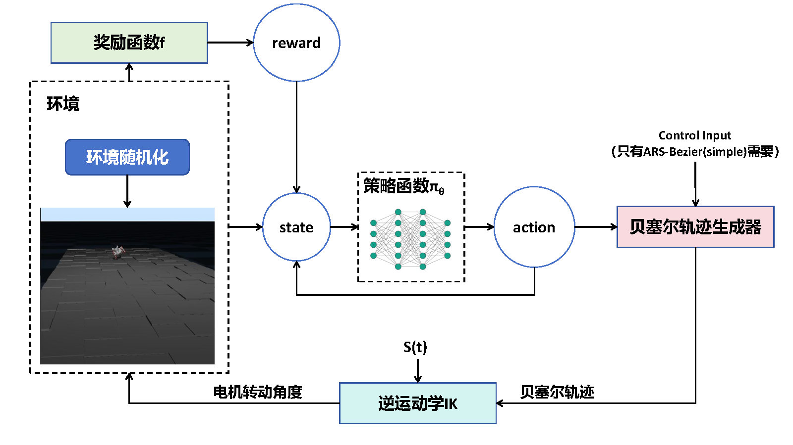
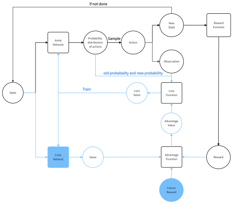

# Final Project: ARS-Bezier in Robot Rat NeRmo

**Article: **under way

**Author: ** Zijian Zhao

**Supervisors: ** Prof. Gangchen, Prof. Kai Huang, Zitao Zhang


## 1. ARS-Bezier Method



To train the model, use the following command. You can also use `--help` to find useful parameters such as learning rate.

```shell
python train.py --modelPath <environment path>
```

If you want to use the ARS-Bezier (simple) method, you can run `train_simple.py` in the same way.


To evaluate your model, you can use:

```shell
python eval.py --modelPath <environment path> --parameterPath <parameter path>
```

or

```shell
python eval_simple.py --modelPath <environment path> --parameterPath <parameter path>
```


## 2. Random Environment

To train the model in a random environment, you can use the `random_env` function in `environment.py` and set the `--modelPath` parameter as `./models/my_test.xml`.


## 3. Other Models

Other models like PPO and ETG-RL are located in the "discard" folder, but they may have some bugs.


